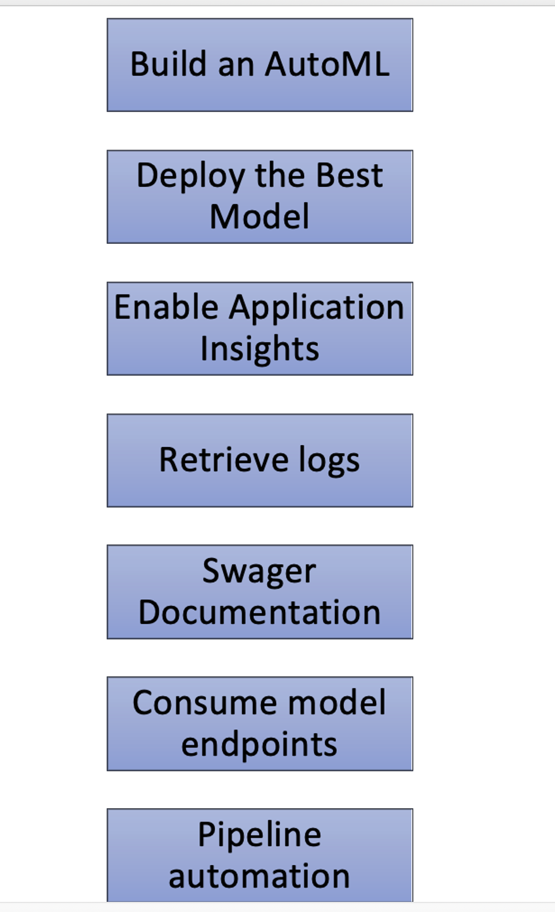
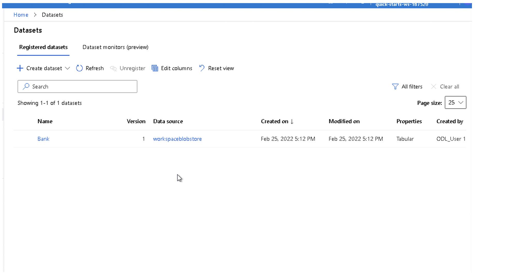
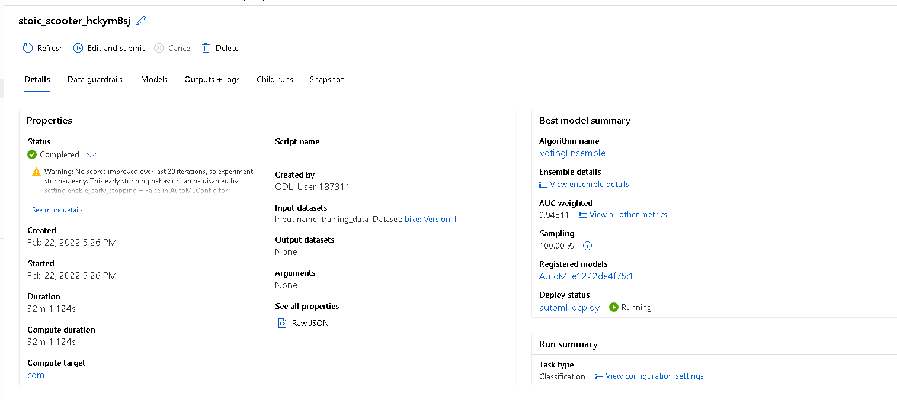
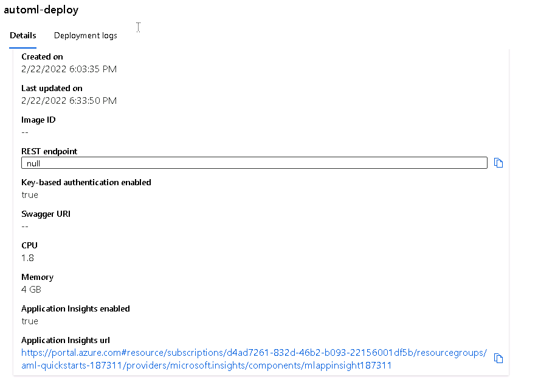
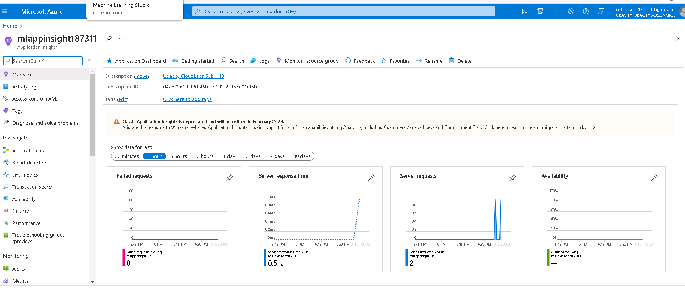
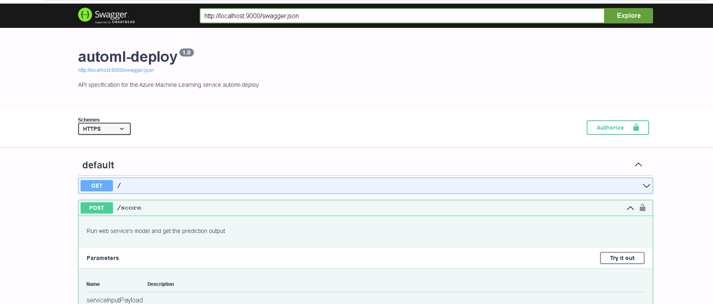
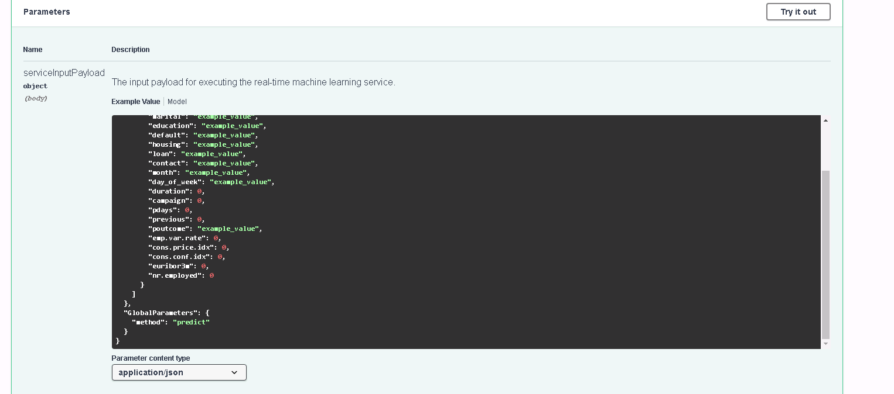
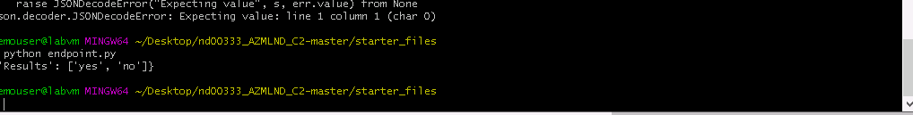
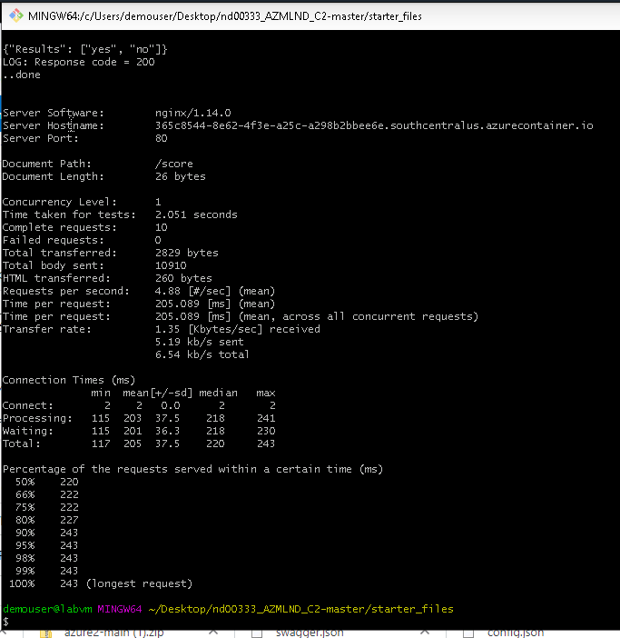

# Project Overview

In this, a machine learnining model is operationalize using a Bank Marketing Dataset. The goal is to design a machine learning production model, deploy it, consume and create, publish and consume a pipeline for automating a machine learning step.

## Architectural Diagram

# Key Steps
## Step 1: Automated ML Experiment

To build an AutoML,  the banking dataset is updated, a compute clusted is set up, the automl is defined and allowed to run.

Bank Marketing Datasets

Best Model

## Step 2: Deploy the best model
The best model is deployed using Azure container instance and authentication is enabled then the application insights in enabled. 

## Step 3: Retrieve logs and Swagger Documentation

## Step 4: Consume endpoints and Benchmark results

Benchmark

